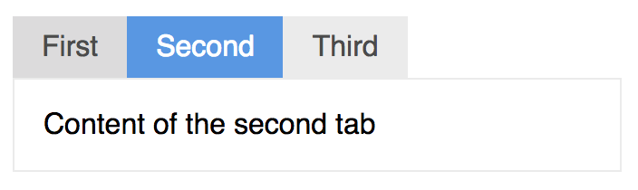
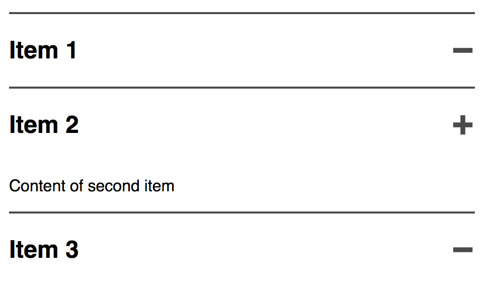

# Compound Components

In this chapter we want to look into compound components,components which consistent of a combination of multiple components which are tightly coupled.

Here's an example of a compound component usage for tabbed navigation.

{width: 50%}


```html
<tabs>
  <tab name="First">
    Content of the first tab
  </tab>
  <tab name="Second">
    Content of the second tab
  </tab>
  <tab name="Third">
    Content of the third tab
  </tab>
</tabs>
```

In order to use this tabbed navigation pattern you work with two actual components which are designed to work closely together. This has the advantage, that the usage of
this component is super simple and all the logic can be nicely encapsulated.

There no one true way to build such a component and in this chapter we will look into two methods. One is relying on `$children` the other is using the provide/inject feature.

## Tabbed Navigation using `$children`

Let's see how we can implement this tabbed navigation, starting with a single tab:

```js
Vue.component("tab", {
  template: "#tab-component-template",
  props: [ "name" ],
  data() {
    return {
      isActive: {
        type: Boolean,
        default: false
      }
    }
  },
  computed: {
    hash() {
      return `#${this.name.toLowerCase().replace(/ /g, '-')}`;
    }
  }
});
```

The `tab` component's only prop is a `name` for the tab title. And we use an `isActive` boolean state to show if the tab is active in which case can show/hide the tab content or change the styling of the 
tab links.

The `hash` computed prop will be used by the parent to render a link with an anchor to this particular tab section. This will become much clearer when we discuss the parent component though.

So, let's first look into the template:

```html
<template id="tab-component-template">
  <section v-show="isActive" :id="hash" :aria-hidden="!isActive" role="tabpanel">
    <slot></slot>
  </section>
</template>
```

It uses a slot for the tab content to allow injection of arbitrary content and the `isActive` state to toggle the visibility using the `v-show` directory. Note, that the `name` prop is not used at all, since
the template is only responsible for the tab content part. The rendering of the name and the actual tab is delegated to the parent component.

In order to support screen readers we also set the `aria-hidden` flag depending on the `isActive` state and `role` attribute to `tabpanel`.

The parent container has much more responsibility including knowing about all its children.

```js
Vue.component("tabs", {
  template: "#tabs-component-template",
  data()  {
    return {
      tabs: []
    }
  },
  mounted() {
    this.tabs = this.$children;
    if (this.tabs.length) {
      this.selectTab(this.tabs[0].hash);
    }
  },
  methods: {
    findTab(hash) {
      return this.tabs.find(tab => tab.hash === hash);
    },
    selectTab(hash) {
      const selectedTab = this.findTab(hash);
      if (!selectedTab) {
          return;
      }

      this.tabs.forEach(tab => {
        tab.isActive = (tab.hash === selectedTab.hash);
      });
      this.$emit('changed', { tab: selectedTab });
    }
  }
});
```

The `mounted` lifecycle method initializes the `tabs` variable based on the `$children` of the component and selects the first child per default using the `selectTab` method.

`selectTab` is a bit more involved. It first finds the tab with the matching `hash` and if found it will set the `isActive` state for each tab. Note, that this is the `hash` we saw before in the tab component as a computed property:

```js
computed: {
  hash() {
    return `#${this.name.toLowerCase().replace(/ /g, '-')}`;
  }
}
```

It uses the name and transforms it into an URL safe string by replacing whitespace with dashes and prefixing a `#` characters. This hash can then directly be used for the anchor link in the template.

In order to be a good citizen we additionally emit the `changed` event with the selected tab.

Now, let's look into the template responsible for rendering all the tabs:

```html
<template id="tabs-component-template">
  <div class="tabs-component">
    <ul class="tab-list">
      <li v-for="(tab, i) in tabs" :key="i" class="tab">
        <a :href="tab.hash" :class="{ 'is-active': tab.isActive }" class="tab-link"
          @click="selectTab(tab.hash)">{{tab.name}}</a>
      </li>
    </ul>
    <div class="tab-content">
      <slot></slot>
    </div>
  </div>
</template>
```

The main parts of the template are the list of tab links and the currently visible tab content. We use a `<ul>` list with the `v-for` directive to render a link for each child using the `name` and `hash` prop. On link click we call `selectTab` to do the selection of the clicked tab and deselection of all other tabs.

The actual children are rendered using a slot inside a container div with the `tab-content` class.

Let's also add all aria attributes for screen readers:

```html
<template id="tabs-component-template">
  <div class="tabs-component">
    <ul role="tablist" class="tab-list">
      <li v-for="(tab, i) in tabs" :key="i" class="tab" role="presentation">
        <a :href="tab.hash"
          :aria-controls="tab.hash" :aria-selected="tab.isActive" role="tab" 
          :class="{ 'is-active': tab.isActive }" class="tab-link"
          @click="selectTab(tab.hash)">{{tab.name}}</a>
      </li>
    </ul>
    <div class="tab-content">
      <slot></slot>
    </div>
  </div>
</template>
```

We set the `role` attributes for all elements and use the `isActive` state of the tab to toggle the `aria-selected` attribute.

For a more complete summary about the aria attributes usage I highly recommend [heydonworks.com](http://heydonworks.com/practical_aria_examples/#tab-interface) website which goes into great detail for this 
particular type of tabbed navigation pattern.

Using `$children` enables us to encapsulate all the business logic in the parent component and leave the child component straight forward to implement. But, it also has it's drawbacks. Our compound component
would break if we would insert another child component which is not a tab and therefore doesn't provide a `name` and `hash`. The component hierachy is tightly coupled, meaning there cannot be another HTML component 
wrapping the children. The children must be direct descendants of the parent for this pattern to work correctly.

On the other hand this pattern will not work when the actual tab selection would be handled inside the children. We look into such a scenario in our next example.

## Accordion using Provide/Inject

We already implemented a rudimentary accordion component in a previous chapter. Let's build on that and turn this into a compound component.

{width: 50%}


Again, we would like to make the usage as simple as possible. This is how the accordion component should be used:

```html
<accordion>
  <accordion-item name="Item 1">
    Content of first item
  </accordion-item>
  <accordion-item name="Item 2">
    Content of second item
  </accordion-item>
  <accordion-item name="Item 3">
    Content of third item
  </accordion-item>
</accordion>
```

This time we start with the main container component. We will use the provide/inject pattern and the container component is the provider for all the functionality injected into all children.

```js
Vue.component("accordion", {
  template: "#accordion-template",
  provide() {
    return {
      accordion: {
        items: this.items,
        register: this.register,
        select: this.select,
        isActive: this.isActive
      }
    }
  },
  data() {
    return {
      items: {}
    }
  },
  methods: {
    register(name) {
      this.$set(this.items, name, false);
    },
    isActive(name) {
      return this.items[name];
    },
    select(name) {
      const currentState = this.items[name];
      Object.keys(this.items).map(n => {
        if (n === name) {
          this.$set(this.items, n, !currentState);  
        } else {
          this.$set(this.items, n, false);
        }
      });
    }
  }
});
```

The component manages the expand/collapse state of all children using an `items` object where the key is the `name` of the child and the value is the expanded state. 

Each child must be able to register itself by the parent using the `register` method. The `isActive` method returns the expand/collapse state and the `select` method is called to 
change the state. The `select` method is a bit more involved because it sets the state to `true` (expanded) for the selected item and to `false` (collapsed) for all other items.

All these methods are then exposed in an `accordion` object using the `provide` feature.

After each child called the `register` function the `items` state looks like this:

```js
{
  "Item 1": false,
  "Item 2": false,
  "Item 3": false
}
```

The template of this container component is using a slot to render the children. Not much to do here since all the rendering is handled in the children.

```html
<template id="accordion-template">
  <div class="accordion">
    <slot></slot>
  </section>
</template>
```

The child component `accordion-item` injects all the methods from the containers:

```js
Vue.component("accordion-item", {
  template: "#accordion-item-template",
  inject: ["accordion"],
  props: ["name"],
  computed: {
    isActive() {
      return this.accordion.isActive(this.name);
    }
  },
  methods: {
    select() {
      this.accordion.select(this.name);
    }
  },
  created() {
    this.accordion.register(this.name);
  }
});
```

In the `created` lifecycle it registers itself by it's `name`. And it exposes the `isActive` and the `select` methods to the template by calling the injected methods from the parent container.

You might remember the template we used in a previous chapter to render the accordion item:

```html
<template id="accordion-item-template">
  <div class="expandable">
    <h2 class="expandable__header">
      {{name}}
      <button class="expandable__trigger" :aria-expanded="isActive" @click="select">
        <svg aria-hidden="true" focusable="false" viewBox="0 0 10 10">
          <rect v-if="isActive" height="8" width="2" y="1" x="4"/>
          <rect height="2" width="8" y="4" x="1"/>
        </svg> 
      </button>
    </h2>
    <div v-if="isActive" class="expandable__content">
      <slot></slot>
    </div>
  </div>
</template>
```

It makes use of the `isActive` computed prop to toggle the expanded/collapsed state and the SVG icon changes. The `select` method is called when clicking the +/- button.

Even though it seems that the child component is more involved than the parent, all it does is actually calling some methods from the parent. It doesn't handle any state on its own.

## Summary

In this chapter we looked into two implementations of the compound component pattern using either `$children` or the provide/inject pattern. Both are valid options, but it highly 
depends on your use case which way you go.

Compared to using the `$children` the provide/inject implementation is a bit more robust in regard to the component hierarchy. Additionally, it provides a clean API via the provide/inject
functions. You know exactly what functions are available, whereas in the `$children` method you have to look into the code much more closely to spot the access to the `name` and `hash` of the child.

It is generally seen as a bad practice to design components which rely on `$parent` or `$children`, because it makes it difficult to reuse the components. We have seen that in some cases
using `$children` is actually not so bad as long as the components are build to work together and the tight coupling simplifies the usage of the component. On the other hand, I haven't 
seen any good arguments for using `$parent`.