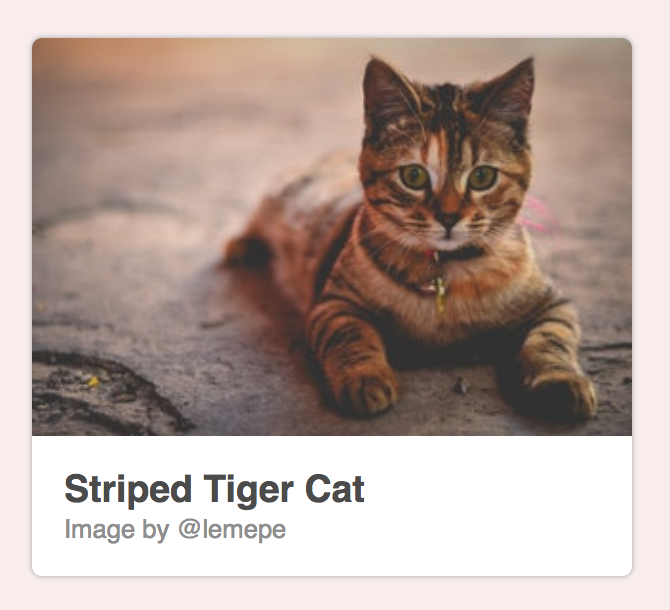
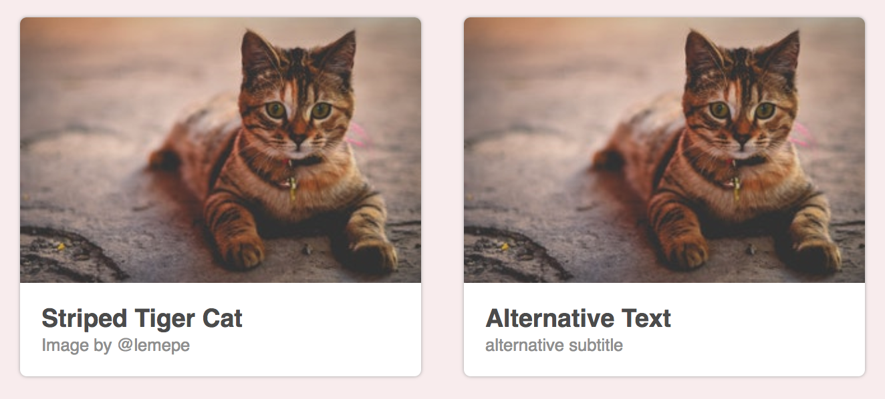
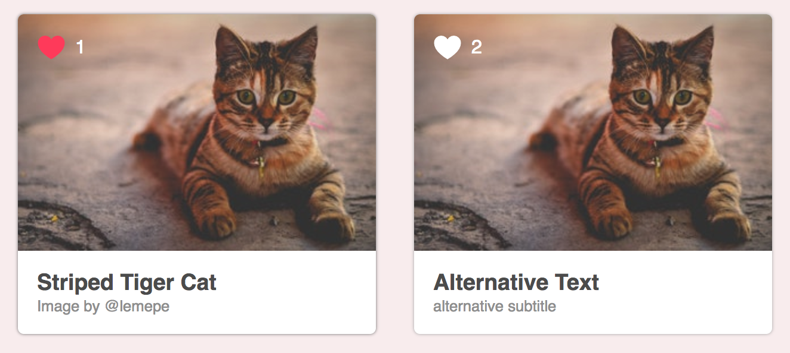

# Introduction to Components with Vue.js

In this chapter we introduce the Vue.js component model and show the benefits of component reuse and
encapsulation.

We will start with a simple example component and gradually improve its functionality.

## Components can be reused

Let's start with a simple and fun image card example. Who doesn't like cats?

{width=50%}


The HTML for this card component consists of a large image area and body with some text:

```html
<div id="demo">
  <div class="image-card">
    
    <div class="image-card__body">
      <h3 class="image-card__title">Striped Tiger Cat</h3>
      <div class="image-card__author">Image by @lemepe</div>
    </div>
  </div>
</div>
```

We use the root HTML element with the `demo` id as our element to initiate Vue:

```js
new Vue({ el: '#components-demo' })
```

You can find the complete example on [Github](https://github.com/fdietz/vue_components_book_examples/tree/master/chapter-2/example-1).

What did we achieve? We used Vue.js to render this image card. But we can't really reuse this as is. We have to turn this into a component first.

So, let's separate the image card from the remaining Vue.js application.

First we introduce a template element with all the image card content:

```html
<template id="template-image-card">
  <div class="image-card">
    
    <div class="image-card__body">
      <h3>Striped Tiger Cat</h3>
      <div class="image-card__author">Image by @lemepe</div>
    </div>
  </div>
</template>
```

And we define the component with `Vue.component` and reference our template id `template-image-card`:

```js
Vue.component('image-card', {
  template: "#template-image-card"
})
```

This is again wrapped in an HTML root element:

```html
<div id="demo">
  <image-card></image-card>
  <image-card></image-card>
</div>
```

And then instantiated:

```js
new Vue({ el: '#demo' })
```

You can find the complete example on [Github](https://github.com/fdietz/vue_components_book_examples/tree/master/chapter-2/example-2).

And voila! We have two cats :-)


Now, two cats are obviously better than one cat and we showed that we can have several instances of our `image-card` component on the same page.

But still, this component is not very useful? It is just not flexible enough! It would be awesome if we could change
the image and text body for each component.

## Passing data to child components as props

In order to customize the component's behaviour, we will use props.

Let's start with how we want to use our component:

```html
<div id="demo">
  <image-card image-src="cat1.jpg" heading="Striped Tiger Cat" text="Image by @lemepe"></image-card>
  <image-card image-src="cat2.jpg" heading="Alternative Text" text="alternative subtitle"></image-card>
</div>
```

We introduce three new props `image-src`, `heading`, and `text`. When using the component these will be passed along as HTML attributes.

The `prop` definition of our component comes next:

```js
Vue.component('image-card', {
  template: "#template-image-card",
  props: {
    heading: String,
    text: String,
    imageSrc: String
  }
});
```

Note, how the prop `imageSrc` is written in camelCase whereas the HTML attributes is using a dash `image-src`.

And the accompanying template uses this props in the camelCase format again:

```html
<template id="template-image-card">
  <div class="image-card">
    
    <div class="image-card__body">
      <h3>{{heading}}</h3>
      <div class="image-card__author">{{text}}</div>
    </div>
  </div>
</template>
```

You can find the complete example on [Github](https://github.com/fdietz/vue_components_book_examples/tree/master/chapter-2/example-3).

Let's have a look at the result:



It worked! We have used two instances of our `image-card` component with different props.

Isn't it nice that we can render a component differently using props as inputs?

### Components have state

In my typical day job a product manager would most probably note that the `image-card` by itself looks quite nice with the cats and such. But, it is not really engaging yet. How about we let users like our cat and we could then keep a count of which cat had the most likes?

Components can have state using the `data` attribute:

```js
   Vue.component('image-card', {
    template: "#template-image-card",
    props: {
      heading: String,
      text: String,
      imageSrc: String
    },
    data: function () {
      return {
        count: 0
      }
    }
  });
```

Note, that `data` is returning
a function instead of only a Javascript object, like this:

```js
data: {
  count: 0
}
```

This is required, so that each component instance can maintain an independent copy of the returned data.

Our template uses this count:

```html
<template id="template-image-card">
  <div class="image-card">
      
    <div class="image-card__body">
        <h3 class="image-card__heading">{{heading}}</h3>
      <div class="image-card__author">{{text}}</div>
      <div class="image-card__heart" @click="count++">
        <svg viewBox="0 0 32 29.6">
          <path d="M16,28.261c0,0-14-7.926-14-17.046c0-9.356,13.159-10.399,14-0.454c1.011-9.938,14-8.903,14,0.454 C30,20.335,16,28.261,16,28.261z"/>            
        </svg>
      </div>
      <div class="image-card__count" v-if="count > 0">{{count}}</div>
    </div>
  </div>
</template>
```

You can find the complete example on [Github](https://github.com/fdietz/vue_components_book_examples/tree/master/chapter-2/example-4).

We use an SVG element to render a little heart and on the `click` event we increment the count by 1. A little count is displayed next to the heart with the current `count` value.



Note, that each component instance has its own local state of `count` which can be changed independently from the other component's `count`.

Whereas in the previous example we only encapsulated the HTML code and made it more flexible with props. We now also encapsulate some business logic to keep count.

Whereas `props` are the input parameters of our component, the state is something internal to the component and is hidden from a user of our component's code. We could change the name of our variable from `count` to `clickCount` and a user of our component wouldn't even need to know. It is an implementation detail.

## Sending messages to parents with events

Now that we know how to pass data down to children and how to encapsulate state. There one thing missing: How can we get data back from a child?

We can use `$emit` to send an event called `change` with data to the parent:

```js
Vue.component('image-card', {
  template: "#template-image-card",
  props: {
    heading: String,
    text: String,
    imageSrc: String
  },
  data: function () {
    return {
      count: 0
    }
  },
  methods: {
    handleClick() {
      this.count++;
      this.$emit("change", this.count);
    }
  }
});
```

We defined the method `handleClick` which not only increments our `count` state, but additionally uses `$emit` to send a message to our parent. The `handleClick` is called in the on `click` event of our heart:

```html
<template id="template-image-card">
  <div class="image-card">
    
    <div class="image-card__body">
        <h3 class="image-card__heading">{{heading}}</h3>
      <div class="image-card__author">{{text}}</div>
      <div class="image-card__heart" @click="handleClick">
        <svg viewBox="0 0 32 29.6">
          <path d="M16,28.261c0,0-14-7.926-14-17.046c0-9.356,13.159-10.399,14-0.454c1.011-9.938,14-8.903,14,0.454 C30,20.335,16,28.261,16,28.261z"/>            
        </svg>
      </div>
      <div class="image-card__count" v-if="count > 0">{{count}}</div>
    </div>
  </div>
</template>
```

Now the parent template can use this to listen to the `change` event to increment a `totalCount`:

```html
<div id="demo">
  <image-card image-src="cat.jpg" heading="Striped Tiger Cat" text="Image by @lemepe" @change="handleChange"></image-card>
  <image-card image-src="cat.jpg" heading="Alternative Text" text="alternative subtitle" @change="handleChange"></image-card>
  <p>Total Count: {{totalCount}}</p>
</div>
```

Together with the Vue.js instance to keep track of a `totalCount`:

```js
new Vue({
  el: '#demo',
  data: {
    totalCount: 0
  },
  methods: {
    handleChange(count) {
      console.log("count changed", count);
      this.totalCount++;
    }
  }
});
```

You can find the complete example on [Github](https://github.com/fdietz/vue_components_book_examples/tree/master/chapter-2/example-5).

Note, that the parent doesn't know about the component's internals. It just knows that there's a change event available and that the message sends the components' `count`.

## Summary

In this chapter we explored the base concepts of a component model. We discussed component reuse and encapsulation,
how to use props to pass data to children and how to emit events to pass messages to the parent.