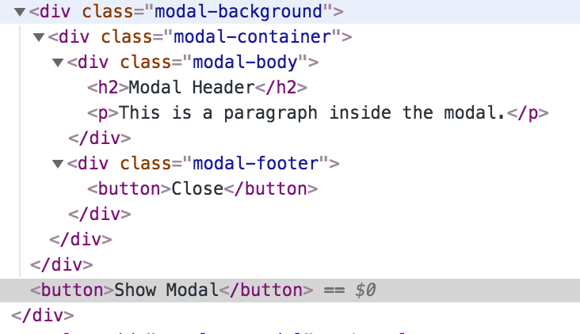

# Component Composition with Vue.js Slots

In the previous chapter we've seen how `props` can be used to pass data to child components. In this chapter we focus on slots which
give your components even more flexibility by injecting content into child components.

For this chapter we use a modal dialog as an example.


## Slots as Content Placeholders

We start with the smallest possible modal dialog implementation where the rendering of the modal is done using a `v-if` directive with the `showModal` variable.

```js
new Vue({
  el: "#demo",
  data: {
    showModal: false
  }
});
```

The `showModal` value is set to `true` on button click:

```html
<div id="demo">
  <modal v-if="showModal" @close="showModal = false">
    <h2>Modal Header</h2>
    <p>This is a paragraph inside the modal.</p>
  </modal>
  <button @click="showModal = true">Show Modal</button>
</div>
```

Our `modal` component children consist of some example HTML heading and paragraph we'd like to show inside the modal dialog.

Additionally, a `close` event is send by the modal component if the component's close button was pressed.

Let's have a look at the component:

```html
<template id="template-modal">
  <div class="modal-background" @click.self="$emit('close')">
    <div class="modal-container">
      <div class="modal-body">
        <slot></slot>
      </div>
      <div class="modal-footer">
        <button @click="$emit('close')">Close</button>
      </div>
    </div>
  </div>
</template>
```

You can find the complete example on [Github](https://github.com/fdietz/vue_components_book_examples/tree/master/chapter-3/example-1).

The `modal-body` contains a `slot` component which acts as a placeholder for our content we passed along above. It will not be visible in the browser DOM and will be replaced with our content. 



The `modal-background` class used to render a darkened overlay underneath the modal dialog. Additionally, it emits a `click` event to close the dialog. The `self` [event modifier](https://vuejs.org/v2/guide/events.html#Event-Modifiers) is used to make sure the event is only emitted when clicking the background and not when clicking the modal dialog itself.

## Named Slots

In our previous example we used the "default slot" to pass along all content to our modal component. In the next example we improve the modal dialog component further by using "named slots" which enables users of the component to pass along content to multiple named slots.

In order to become more flexible, we introduce named slots for the header, body and footer. Here is the definition of our markup:

```html
<template id="template-modal">
  <div class="modal-background" @click.self="$emit('close')">
    <div class="modal-container">
      <div class="modal-header">
        <slot name="header"></slot>
      </div>
      <div class="modal-body">
        <slot name="body"></slot>
      </div>
      <div class="modal-footer">
        <slot name="footer">
          <button @click="$emit('close')">Close</button>
        </slot>
      </div>
    </div>
  </div>
</template>
```

Note the usage of the `name` attribute for each slot and how each `slot` is wrapped in another `div` element. The component has complete control of the styling by using specific CSS classes `modal-header`, `modal-body` and `modal-footer`. And the user of the component can focus on the content only.

The usage of these named slots is quite similar to the default slot:

```html
<modal v-if="showModal" @close="showModal = false">
  <h2 slot="header">Modal Header</h2>
  <div slot="body">Modal Body</div>
</modal>
```

We can use whatever HTML element we want for our content and use the `slot` attribute to select the appropriate slot we want to use.

Note, that the `footer` slot is not used in this example. By default the existing slot content will be used. In our case the `footer` slot is defined like this:

```html
<slot name="footer">
  <button @click="$emit('close')">Close</button>
</slot>
```

You can find the complete example on [Github](https://github.com/fdietz/vue_components_book_examples/tree/master/chapter-3/example-2).

So, we still have our Close button as is.

## Conclusion

In this chapter we looked into slots and named slots to compose our components and content in a very flexible way.