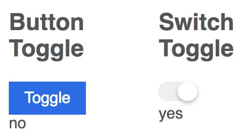

# Headless Components

In this chapter we'd like to further investigate the usage of scoped slots by introducing the concept of "headless" or how they are sometimes called "renderless" components.

Headless components aim for maximum flexibility by completely separating the logic from the rendering. This is especially useful when a component contains a large amount of business logic.

Let's look into a typical example made famous by Kent Dodds when he introduced these concepts more deeply in the context of React where render props are used for similar problems.

## The Toggle Component

The `Toggle` component encapsulates logic to toggle a `Boolean` state useful for various kinds of scenarios including switch components, expand/collapse scenarios, etc.

The usage of a component can be best used to figure out the component requirements:

```html
<Toggle @change="handleChange">
  <div slot-scope="{active, toggle}">
    <button @click="toggle" class="button">Toggle</button>
    <div>{{active ? "yes" : "no"}}</div>
  </div>
</Toggle>
```

We start with a button which toggles the `active` state. The `active` and `toggle` props are passed along via a `slot-scope` as seen already in the previous chapter. The `change` event is useful to users of the component to get notified of changes.

The template of our `Toggle` only really needs to use the `slot` mechanism to pass these props along:

```html
<template id="toggle-template">  
  <slot :active="active" :toggle="toggle"></slot>
</template>
```

And the `Toggle` component itself defines the `active` state and the `toggle` method which is responsible for toggling the state and emitting the `change` event.

```js
Vue.component("Toggle", {
  template: "#toggle-template",
  data() {
    return {
      active: false
    }
  },
  methods: {
    toggle() {
      this.active = !this.active;
      this.$emit("change", this.active);
    }
  }
});
```

And the Vue instance implements the `handleChange` method:

```js
new Vue({ 
  el: '#demo',
  methods: {
    handleChange(active) {
      console.log("changed to ", active)
    }
  }
});
```

The example by itself is not really showing the flexibility of the headless component pattern. But, it exemplifies the complete separation of state management logic and the actual rendering. The latter is completely up to the client to implement. 

Let's implement another example but this time with a more complex component: the switch component.

```html
<Toggle @change="handleChange">
  <div slot-scope="{active, toggle}">
    <switch-toggle :value="active" @input="toggle"></switch-toggle>
    <div>{{active ? "yes" : "no"}}</div>
  </div>
</Toggle>
```

Note, how the usage did not change at all. The only difference is that instead of a button we have a switch toggle.

%{width: 60%}


The switch component's implementation is not important for this example, but let's go over it quickly. First of all: It is a controlled component and has no internal state.

```js
Vue.component("SwitchToggle", {
  template: "#switch-template",
  props: ["value, input"]
});
```

And the template:

```html
<template id="switch-template">  
  <label class="switch">
    <input type="checkbox" :checked="value" @change="$emit('input', $event.target.checked)"/>
    <div class="switch-knob"></div>
  </label>
</template>
```

The `value` prop is bound to the `checked` attribute and on change we emit an `input` event with the current state.

Isn't it fantastic that we could reuse our `Toggle` component unchanged here even though the end result looks completely different?

There's one more thing! Since the `Toggle` component does not really render much besides the slot, we can simplify our code but using a render function instead of a template:

```js
Vue.component("Toggle", {
  // leanpub-start-delete
  template: "#toggle-template",
  // leanpub-end-delete
  // leanpub-start-insert
  render() {
    return this.$scopedSlots.default({
      active: this.active,
      toggle: this.toggle
    });
  },
  // leanpub-end-insert
  data() {
    return {
      active: false
    }
  },
  methods: {
    toggle() {
      this.active = !this.active;
      this.$emit("change", this.active);
    }
  }
});
```

The component is now solely defined via Javascript containing the business logic. No template used at all. Nice!

Let's see how far we can go with our `Toggle` component and if we can make it even more flexible.

## Expand/Collapse Component and Prop Collections

Our `Toggle` can be reused again for a completely different use case. We want to implement a simple expand/collapse toggle which looks like this.


And we can achieve it by using markup only:

```html
<Toggle @change="handleChange">
  <div slot-scope="{active, toggle}" class="expandable">
    <h2 class="expandable__header">
      Heading 2
      <button class="expandable__trigger" @click="toggle" aria-expanded="active">
        <svg aria-hidden="true" focusable="false" viewBox="0 0 10 10">
          <rect v-if="active" height="8" width="2" y="1" x="4"/>
          <rect height="2" width="8" y="4" x="1"/>
        </svg>
      </button>
    </h2>
    <div v-if="active" class="expandable__content">
      Lorem Ipsum is simply dummy text of the printing and typesetting industry. Lorem Ipsum has been the industry's standard dummy text ever since the 1500s, ...
    </div>
  </div>
</Toggle>
```

We use a button to toggle the state again using the `toggle` prop and the `active` prop is used to conditionally render the expandable content. Additionally, the `active` prop is used to render a slightly different SVG icon depending on if the state is expanded or collapsed.

There's an opportunity here to generalize the `Toggle` component even more. We could always support the toggling action by providing a `click` event. And the `aria-expanded` attribute could be somehow passed along, too.

Let's first check how the usage would look like after making these props available:

```html
<Toggle @change="handleChange">
  <div slot-scope="{active, togglerProps, togglerEvents}" class="expandable">
    <h2 class="expandable__header">
      Heading 2
      <button class="expandable__trigger" v-bind="togglerProps" v-on="togglerEvents" >
        <svg aria-hidden="true" focusable="false" viewBox="0 0 10 10">
          <rect v-if="active" height="8" width="2" y="1" x="4"/>
          <rect height="2" width="8" y="4" x="1"/>
        </svg> 
      </button>
    </h2>
    <div v-if="active" class="expandable__content">
      Lorem Ipsum is simply dummy text of the printing and typesetting industry. Lorem Ipsum has been the industry's standard dummy text ever since the 1500s, ...
    </div>
  </div>
</Toggle>
```

The `slot-scope` now provides `active`, `togglerProps` and `togglerEvents` and the `toggle` is gone. The `togglerProps` is actually not a single prop but an object with multiple props. Is is therefore convenient to use `v-bind` to apply all props automatically. Same goes for the `togglerEvents` where we have to use `v-on` instead, since these are events.

The implementation of `Toggle` component slightly changed to pass along these new props:

```js
Vue.component("Toggle", {
  render() {
    return this.$scopedSlots.default({
      active: this.active,
      // leanpub-start-delete
      toggle: this.toggle
      // leanpub-end-delete
      // leanpub-start-insert
      togglerProps: {
        'aria-expanded': this.active
      },
      togglerEvents: {
        'click': this.toggle
      }
      // leanpub-end-insert
    });
  },
  data() {
    return {
      active: false
    }
  },
  methods: {
    toggle() {
      this.active = !this.active;
      this.$emit("change", this.active);
    }
  }
});
```

The scoped slot passes along the `togglerProps` with the `aria-expanded` attribute and the `togglerEvents` with the `click` event to toggle the state.

We achieved not only an increased reusability but additionally made it more user-friendly by managing the `aria-expanded` attribute automatically.

## Fetch data with a Headless Component

Until now we only discussed headless components for visual component composition, but we can actually go much further. Nothing stops us to use a component to provide some data to the underlying component.

In this example we use the [axios](https://github.com/axios) npm package to do an AJAX request and pass the result along.

Let's have a look at the example usage:

```html
<request url="https://jsonplaceholder.typicode.com/posts/1">
  <div slot-scope="{loading, data}">
    <div v-if="loading">Loading...</div>
    <div v-if="!loading">
      {{data.title}}
      {{data.body}}
    </div>
  </div>
</request>
```

The `request` component uses the `url` prop to config which URL we want to request. In this case we use a free service to return some arbitrary JSON payload back.

The `slot-scope` passes not only the result back as `data` but also gives us a `loading` prop which we use to show a loading indicator while the request is in the loading state. Only after the loading is done we show the response data.

```js
Vue.component("Request", {
  render() {
    return this.$scopedSlots.default({
      loading: this.loading,
      data: this.response && this.response.data
    });
  },
  props: {
    url: String
  },
  data() {
    return {
      loading: true,
      response: null
    }
  },
  created() {
    axios.get(this.url)
      .then(response => {
        this.response = response;
        this.loading = false;
      })
  }
});
```

The `Request` defines the `url` props as it's only configuration and maintains the `response` and the `loading` state. The `created` lifecycle hook is used to fire the HTTP GET request and places the successfull response in the response state. And finally the `render` function passes this information along via the scoped slot mechanism.

This pattern of co-locating the data with the component is actually not far fetched and used by other libraries extensively. You can see examples in the wild as for example in Apollo's GraphQL client where a `Query` and `Mutation` component handle data requirements. 

## Summary

In this chapter we looked into Headless or Renderless components using Vue.js scoped lots and showed how to create highly reusable components which focus only the logic and leave the rendering to the client.

It is fascinating that Vue.js slot mechanism can be used for such a large variety of use cases. And it will be interesting to watch the community come up with even more ideas.
